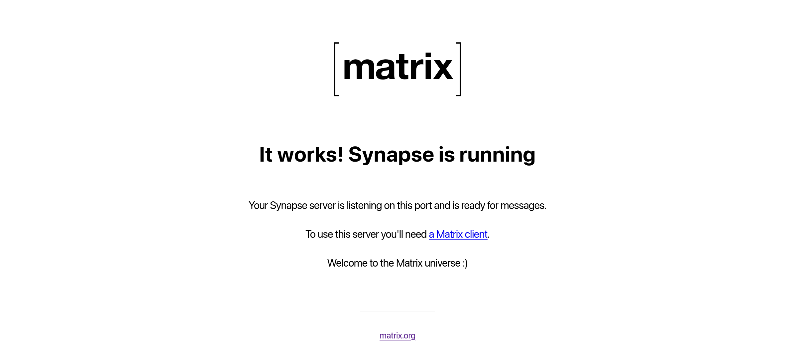

## Introduction

The goal of this guide is to set up a docker installation of [**Synapse**](https://github.com/element-hq/synapse) with [**Delegation**](https://element-hq.github.io/synapse/latest/delegate.html#when-do-i-need-delegation) and **SQLite**

> [!note]
> Throughout this guide, the domain `example.com` will be used as a placeholder for the Matrix server. When setting up your own deployment, be sure to substitute it with your actual domain name.

> [!note]
> All container-related files will be organized under `/srv/containers`. This directory will contain two subdirectories:
> - `boilerplates/` — stores `compose.yaml` files (service definitions).
> - `compose/` — stores persistent data and configurations of said services.

---

## DNS Setup

You will need to configure your domain name registrar (I recommend using Porkbun) to direct requests for your domain to your server's IP address.
Specifically, you'll need to create two **A records** for both your main domain and a subdomain:

*   `yourdomain.com` pointing to your server's external IP address.
*   `matrix.yourdomain.com` also pointing to your server's external IP address.

Don't forget to configure port forwarding for ports 80 and 443 to route to your server's internal IP

---

## Synapse

### Generate a configuration file

```sh
mkdir -p /srv/containers/{boilerplates,compose}/synapse
mkdir -p /srv/containers/{boilerplates,compose}/caddy

docker run -it --rm \
  -v /srv/containers/compose/synapse/data:/data \
  -e SYNAPSE_SERVER_NAME=example.com \
  -e SYNAPSE_REPORT_STATS=no \
  matrixdotorg/synapse:latest generate
```

### Create the Synapse service

```yaml
<!-- /srv/containers/boilerplates/synapse/compose.yml -->
services:
  synapse:
    image: ghcr.io/element-hq/synapse:latest
    container_name: synapse
    restart: always
    ports:
      - 8008:8008
    volumes:
      - /srv/containers/compose/synapse/data:/data
    networks:
      - caddy
networks:
  caddy:
    external: true
```

### Create a server admin

```sh
cd /srv/containers/boilerplates/synapse
docker compose up -d
docker exec -it synapse register_new_matrix_user -c /data/homeserver.yaml
```

```txt showLineNumbers=false
New user localpart: your_admin_username
Password: your_admin_password
Confirm password: your_admin_password
Make admin: yes
```

---

## Caddy

We will be using [Caddy](https://github.com/caddyserver/caddy) as our reverse proxy

### Create the Caddy service

```yaml
<!-- /srv/containers/boilerplates/caddy/compose.yml -->
services:
  caddy:
    image: docker.io/caddy:alpine
    container_name: caddy
    restart: always
    ports:
      - 80:80
      - 443:443
    volumes:
      - /srv/containers/compose/caddy/Caddyfile:/etc/caddy/Caddyfile
      - /srv/containers/compose/caddy/config:/config
      - /srv/containers/compose/caddy/data:/data
    networks:
      - caddy
networks:
  caddy:
    external: true
```

### Create the Caddyfile

```Caddyfile
<!-- /srv/containers/compose/caddy/Caddyfile -->
example.com {
  header /.well-known/matrix/* Content-Type application/json
  header /.well-known/matrix/* Access-Control-Allow-Origin *
  respond /.well-known/matrix/server `{"m.server": "matrix.example.com:443"}`
  respond /.well-known/matrix/client `{"m.homeserver":{"base_url":"https://matrix.example.com"}}`
  
  encode zstd gzip
}

matrix.example.com {
  reverse_proxy /_matrix/* synapse:8008
  reverse_proxy /_synapse/client/* synapse:8008
  request_body {
    max_size 10GB
  }
  @blocked {
    not path /_matrix/*
    not path /_synapse/client/*
  }
  respond @blocked 403
  
  encode zstd gzip
}
```

### Start Caddy

```
docker compose -f /srv/containers/boilerplates/caddy/compose.yml up -d
```

---

## Test the installation

At this point, give the [Matrix Federation Tester](https://federationtester.matrix.org/) a whirl by entering your domain name (for example `example.com`, not `matrix.example.com`). This tool checks if your server is reachable on the expected ports. If you hit any issues, it’s likely to do with the reverse proxy or delegation setup, assuming there’s nothing wrong in the Synapse logs. Make sure to double check that your replaced every mention of `example.com` in the guide with your actual domain name.

You should also be able to view the following at https://matrix.example.com/_matrix/static

<div class="w-full">

</div>

---

## Pick a Client and Sign In

Now is the time to choose a client or app to log in with.

I recommend [Element Web or Desktop](https://matrix.org/ecosystem/clients/element) for desktops and [ Element X](https://matrix.org/ecosystem/clients/element-x) for mobile devices.